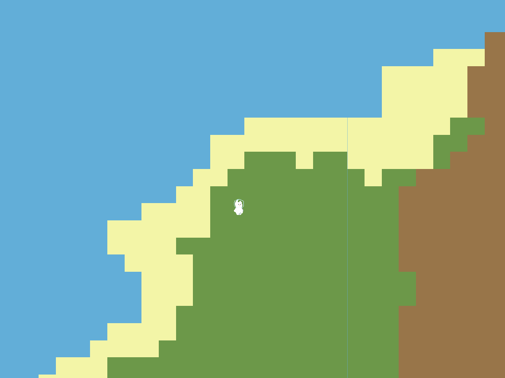
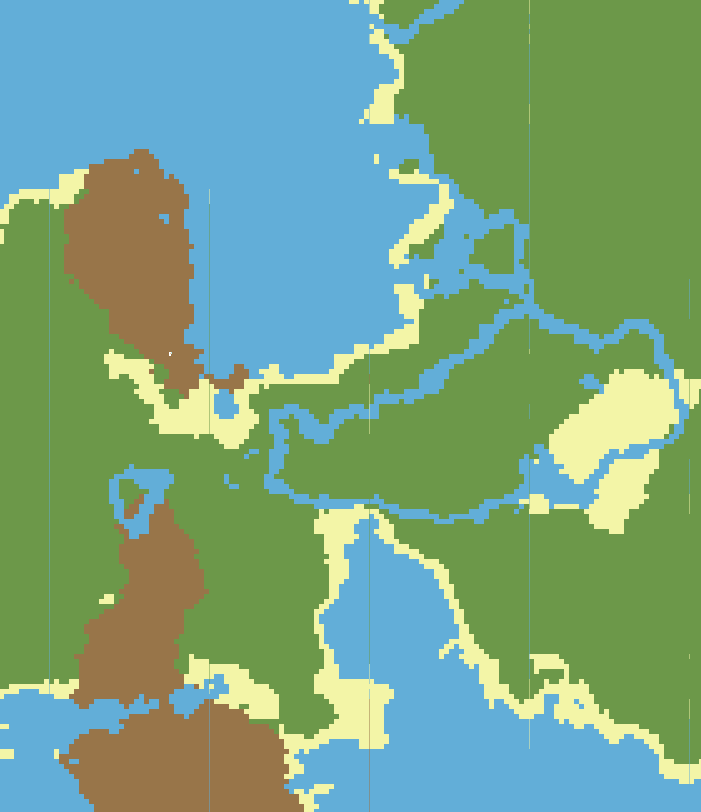
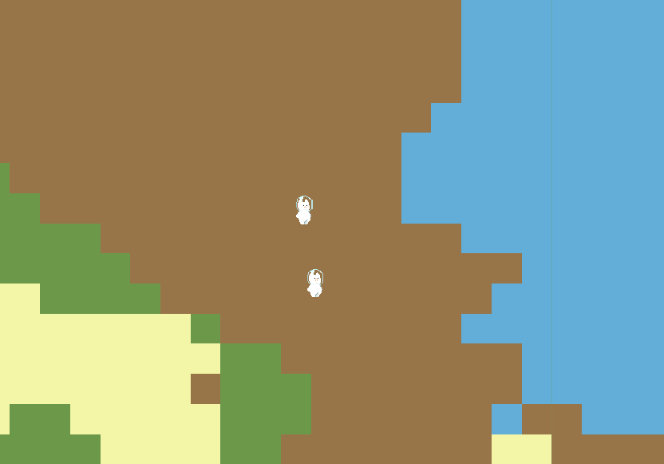

# Catfishing 🎣😺

2D cat fishing game made with Phaser.

You can't fish yet but there is some cool world gen.


## Running locally 

This project requires [Bun](https://bun.sh/) to run.

```bash
# Install dependencies
bun install
```

```bash
# Hosting the backend server on localhost:3000
bun run server
```

```bash
# Hosting the game on localhost:1234
bun run client --host --port 1234
```

## Screenshots



